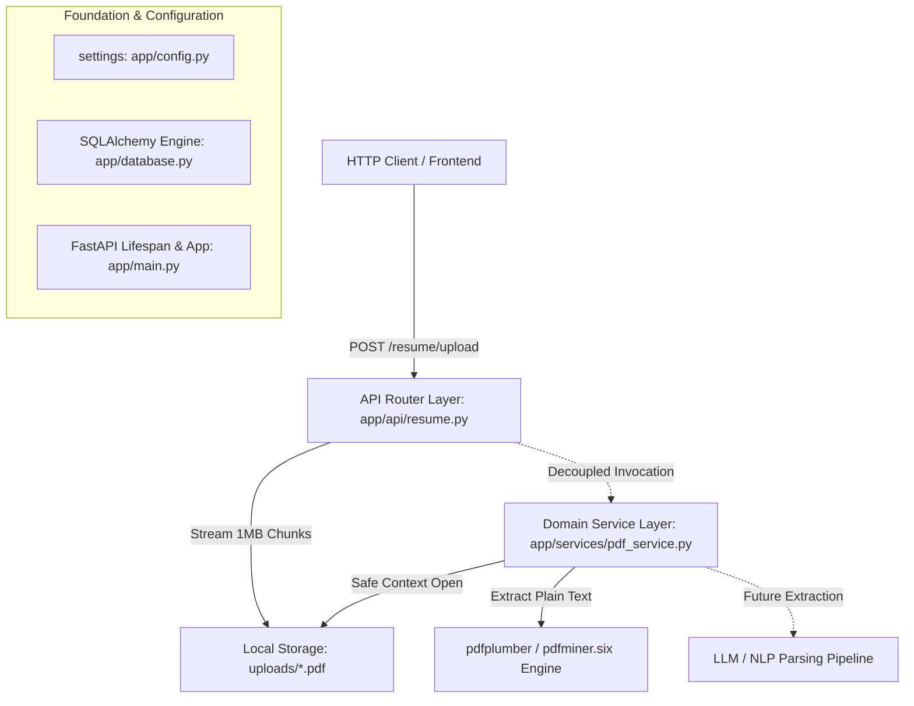
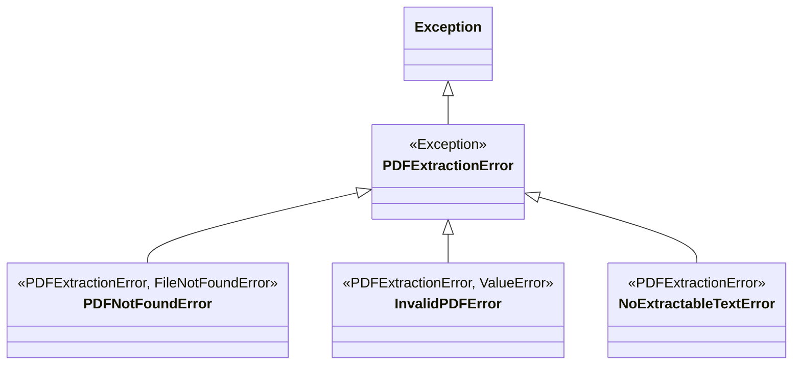

# Smart Resume Screener — Technical Implementation Document

## 1. Executive Summary & Architecture Overview

The **Smart Resume Screener** is an automated, high-performance backend system designed to ingest candidate resumes, extract plain text, parse structured information, and evaluate candidates against job descriptions.

The application adheres strictly to **Clean / Layered Architecture** principles, enforcing clear boundaries between HTTP ingestion, domain business logic, and data storage:



---

## 2. Core Foundation & Configuration

The application skeleton provides centralized configuration, structured logging, database connectivity, and application lifecycle management.

### [app/config.py](file:///c:/Users/kakad/Documents/GitHub/smart-resume-screener/app/config.py)
- **Centralized `Settings` (`pydantic.BaseModel`)**: Type-safe configuration providing centralized values across modules:
  - `APP_NAME`: `"Smart Resume Screener"`
  - `VERSION`: `"0.1.0"`
  - `DATABASE_URL`: `"sqlite:///./smart_resume_screener.db"`
  - `UPLOAD_DIR`: `Path("uploads")`
- **Singleton Instance**: Exported as `settings = Settings()` for zero-overhead imports.

### [app/main.py](file:///c:/Users/kakad/Documents/GitHub/smart-resume-screener/app/main.py)
- **Async Lifespan Context Manager**: Uses `@asynccontextmanager async def lifespan(app: FastAPI)` to log startup initialization (`settings.APP_NAME`, `VERSION`) and clean shutdown routines.
- **FastAPI Application Initialization**: Configured with automated Swagger UI (`/docs`) and ReDoc (`/redoc`) generation.
- **Root & Health Check Endpoints**:
  - `GET /`: Returns API identification and runtime status (`{"status": "running"}`).
  - `GET /health`: System availability verification check (`{"status": "healthy"}`).
- **Router Registration**: Incorporates domain routers (`app.include_router(resume.router)`).

### [app/database.py](file:///c:/Users/kakad/Documents/GitHub/smart-resume-screener/app/database.py)
- **SQLAlchemy ORM Foundation**:
  - `engine = create_engine(settings.DATABASE_URL, connect_args={"check_same_thread": False})`
  - `SessionLocal = sessionmaker(autocommit=False, autoflush=False, bind=engine)`
  - `Base = declarative_base()` for future entity modeling.
- **Database Dependency Generator (`get_db()`)**: Yields transactional sessions and guarantees `db.close()` in `finally` blocks for API route handlers.

---

## 3. Milestone 1: Secure Resume Upload Module

Responsible for receiving, validating, and durably persisting candidate resume files to disk.

### [app/api/resume.py](file:///c:/Users/kakad/Documents/GitHub/smart-resume-screener/app/api/resume.py)
- **Endpoint**: `POST /resume/upload` (`multipart/form-data`)
- **Pydantic Response Schema (`ResumeUploadResponse`)**:
  ```json
  {
      "message": "Resume uploaded successfully",
      "filename": "c9a646d3-9c61-4cd9-9e1e-282c07928e7d.pdf",
      "original_filename": "John_Doe_Resume_2026.pdf",
      "size_bytes": 245810
  }
  ```

### Key Architectural & Security Decisions
1. **`UploadFile` over `bytes` (`SpooledTemporaryFile`)**:
   - **Problem**: Declaring `resume: bytes = File(...)` forces FastAPI to read the entire payload into RAM at request time, causing memory exhaustion under concurrent uploads of multi-megabyte files.
   - **Solution**: `UploadFile` spools payloads in RAM up to 1 MB and rolls over to disk automatically. We read and write the stream in memory-efficient `1 MB` (`CHUNK_SIZE = 1024 * 1024`) chunks.
2. **Multi-Layer File Validation**:
   - **Extension Verification**: Rejects any file where `filename` does not strictly end with `.pdf`.
   - **MIME Type Inspection**: Validates HTTP `Content-Type` headers (`application/pdf`, `application/x-pdf`, `application/octet-stream`).
   - **Magic Byte Signature Check**: Reads the first 5 bytes (`await resume.read(5)`) and checks for `b"%PDF-"`. This prevents attackers from uploading disguised executables (`.exe`, `.sh`) renamed to `.pdf`, and rejects `0-byte` empty files immediately.
3. **Collision-Resistant Storage via UUID v4**:
   - **Problem**: Saving files with user-submitted names invites path traversal attacks (`../../etc/cron.d/hack`) and file collisions when multiple candidates upload `Resume.pdf`.
   - **Solution**: Generates a random `uuid.uuid4()` filename (`{uuid}.pdf`) for local storage in `uploads/`, while preserving `original_filename` sanitized (`Path(resume.filename).name`) in the JSON payload for downstream context tracking.
4. **Atomic I/O Cleanup**:
   - Wrapped inside a `try...except...finally` block. If disk writes fail halfway through, `file_path.unlink()` deletes partial/corrupted files, and `await resume.close()` releases temporary file descriptors.
5. **Decoupling Upload from Parsing**:
   - File upload is **I/O bound** (fast, synchronous confirmation), while PDF parsing/LLM processing is **CPU/network bound** (long-running). Keeping them separated ensures instant HTTP response times and allows background task queues (Celery/RabbitMQ) to scale processing workers independently.

---

## 4. Milestone 2: PDF Text Extraction Service

A reusable domain service isolated from HTTP frameworks, responsible solely for converting local PDF documents into plain text.

### [app/services/pdf_service.py](file:///c:/Users/kakad/Documents/GitHub/smart-resume-screener/app/services/pdf_service.py)
- **Class**: `PDFService`
- **Method**: `extract_text(self, pdf_path: Path) -> str`

### Domain Exception Hierarchy
Rather than raising HTTP errors (`HTTPException`), `PDFService` defines custom, framework-agnostic exceptions inheriting from standard Python errors:


### Key Architectural & Engineering Decisions
1. **`pdfplumber` over PyPDF2/pypdf**:
   - **Problem**: Resumes feature complex multi-column layouts, tables, bulleted lists, and decorative sidebars. Basic parsers (like PyPDF2) often jumble reading order across columns or lose table formatting.
   - **Solution**: `pdfplumber` (`pdfminer.six` under the hood) performs precise spatial layout analysis. It tracks character coordinates, preserves exact reading order across multi-column sections, and extracts text cleanly from tables without requiring heavy system dependencies or OCR tools.
2. **Page-by-Page Iteration & Filtering**:
   - Safely opens documents within a `with pdfplumber.open(pdf_path) as pdf:` context manager to guarantee deterministic file descriptor release.
   - Iterates sequentially (`for page in pdf.pages:`), extracting text per page (`page.extract_text()`).
   - Skips blank or spacer pages (`if page_text and page_text.strip():`) so trailing whitespaces and empty pages do not contaminate output.
   - Joins extracted page strings using double-newline boundaries (`"\n\n".join(extracted_pages)`) to maintain logical section breaks for future LLM ingestion.
3. **HTTP & Framework Agnosticism**:
   - The service has zero dependencies on FastAPI or HTTP request contexts. It can be invoked identically from an API route, an async task queue worker, or a command-line script.
4. **Future-Proofing for OCR Integration**:
   - When a scanned image-only PDF is processed today, `page.extract_text()` returns `None`, raising `NoExtractableTextError`.
   - In future milestones, because page iteration is isolated, an OCR fallback (`pytesseract` or AWS Textract) can be injected cleanly inside the page loop when `page_text is None` without altering `extract_text(pdf_path: Path) -> str` public contracts or downstream callers.

---

## 5. Comprehensive Quality Assurance & Test Suite

The project includes an automated testing suite built with `pytest` and FastAPI's `TestClient`, ensuring 100% verification of domain behaviors and error handling without external database or network dependencies.

### [tests/test_resume.py](file:///c:/Users/kakad/Documents/GitHub/smart-resume-screener/tests/test_resume.py) (Upload Module Tests)
- **`test_upload_valid_resume_pdf`**: Verifies `200 OK`, exact JSON response structure (`message`, `filename`, `original_filename`, `size_bytes`), and confirms binary file persistence on disk in `uploads/`.
- **`test_upload_reject_non_pdf_extension`**: Verifies that uploading `.txt` or `.docx` files raises `400 Bad Request`.
- **`test_upload_reject_invalid_content_type`**: Verifies `400 Bad Request` when unexpected MIME types (`image/png`) are submitted with `.pdf` filenames.
- **`test_upload_reject_missing_magic_bytes`**: Verifies `400 Bad Request` when a `.pdf` file contains non-PDF binary data (missing `%PDF-` header).
- **`test_upload_reject_empty_pdf_file`**: Verifies `400 Bad Request` when uploading a `0-byte` empty file.

### [tests/test_pdf_service.py](file:///c:/Users/kakad/Documents/GitHub/smart-resume-screener/tests/test_pdf_service.py) (Extraction Service Tests)
- **`test_successful_extraction_with_skipped_empty_pages`**: Mocks multi-page PDF documents (`pdfplumber.open`) to verify that valid pages are stripped and joined with `\n\n`, while blank/spacer pages (`""` or `None`) are skipped cleanly.
- **`test_missing_file_raises_pdf_not_found_error`**: Verifies that calling `extract_text()` on a non-existent filesystem path immediately raises `PDFNotFoundError`.
- **`test_corrupted_pdf_raises_invalid_pdf_error`**: Creates a real file containing invalid binary bytes on disk and verifies that unreadable syntax errors raise `InvalidPDFError`.
- **`test_empty_or_non_text_pdf_raises_no_extractable_text_error`**: Verifies that image-only scanned PDFs (where `extract_text()` yields `None`) and `0-page` PDFs raise `NoExtractableTextError`.

---

## 6. Dependency & Package Structure

```text
smart-resume-screener/
├── app/
│   ├── __init__.py
│   ├── config.py              # Centralized Pydantic Settings
│   ├── database.py            # SQLAlchemy Engine, SessionLocal & get_db()
│   ├── main.py                # FastAPI Application & Lifespan Setup
│   ├── api/
│   │   ├── __init__.py        # API Package Initializer
│   │   └── resume.py          # POST /resume/upload Endpoint & Router
│   └── services/
│   │   ├── __init__.py        # Services Package Initializer
│   │   └── pdf_service.py     # PDFService & Domain Exception Hierarchy
├── tests/
│   ├── test_resume.py         # Unit Tests for Resume Upload Endpoint
│   └── test_pdf_service.py    # Unit Tests for PDF Extraction Service
├── uploads/                   # Local Spool Directory for Uploaded PDFs (.gitkeep)
├── requirements.txt           # Core Dependencies (FastAPI, SQLAlchemy, Pydantic, python-multipart, pdfplumber)
└── IMPLEMENTATION.md          # Technical Implementation Documentation
```

### Active Requirements (`requirements.txt`)
- `fastapi>=0.110.0`: High-performance asynchronous web framework.
- `pydantic>=2.0.0`: Data validation and settings management.
- `sqlalchemy>=2.0.0`: SQL ORM and transactional session management.
- `uvicorn>=0.28.0`: ASGI web server implementation.
- `python-multipart>=0.0.9`: Required by Starlette/FastAPI for `multipart/form-data` file upload streaming.
- `pdfplumber>=0.10.0`: High-fidelity spatial PDF text extraction engine.

---

## 7. Next Steps & Future Milestones

With **Milestone 1 (Secure Upload)** and **Milestone 2 (Text Extraction Service)** complete and fully tested, the system foundation is ready for subsequent milestones:
1. **Milestone 3: Background Processing & Queue Integration**:
   - Connect `POST /resume/upload` to asynchronous task workers (`Celery` / `asyncio` background tasks) that invoke `PDFService.extract_text()` upon upload.
2. **Milestone 4: LLM Information Extraction**:
   - Feed the extracted raw text (`str`) into an LLM parsing service (`Instructor` / `OpenAI` / `Gemini`) using structured Pydantic schemas to extract candidates' Skills, Education, and Work Experience.
3. **Milestone 5: Database Persistence & Matching Engine**:
   - Store candidate profiles in SQLite/PostgreSQL (`app/database.py`) and implement vector embedding or keyword-based scoring against job descriptions.
